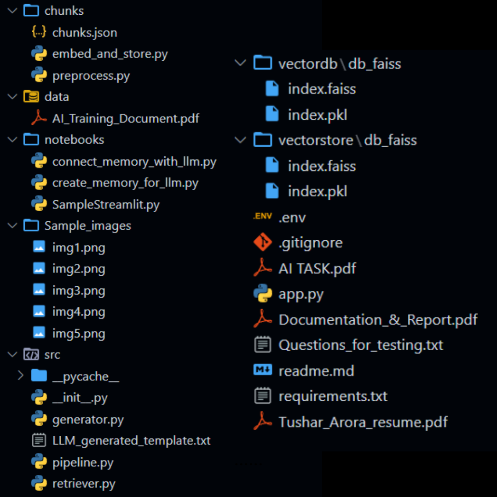
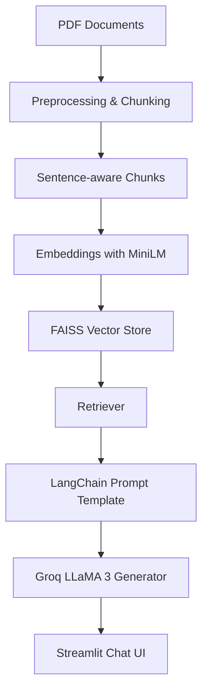

# 🧠 Legal RAG Chatbot (Terms & Conditions / Policies / Contracts)

A Retrieval-Augmented Generation (RAG) chatbot built using **LangChain**, **Groq LLaMA 3**, **FAISS**, and **Streamlit**. It allows users to ask questions about legal documents (Terms & Conditions, Privacy Policies, Contracts), and get grounded, accurate, and clause-aware responses.

---


[PDF OF DOCUMENTATON AND REPORT](Documentation_&_Report.pdf)
## 📐 Project Architecture & Flow



---

## ⚙️ Setup & Installation

```bash
# 1. Clone repo & setup environment
pip install -r requirements.txt
python -m nltk.downloader punkt

# 2. Add your Groq API key to .env
GROQ_API_KEY=your_key_here
```

---

## 🧾 Step-by-Step Instructions

### 1. 🔧 Preprocess & Chunk Documents

* Loads PDFs
* Cleans and splits them into **sentence-aware chunks (300 words)**

```bash
python preprocess.py
```

* Output: `chunks/chunks.json`

### 2. 🧠 Create Embeddings & Save to FAISS

```bash
python embed_and_store.py
```

* Output: `vectorstore/db_faiss/`

### 3. 🔗 Build RetrievalQA Chain

All logic is modularized in `src/`:

* `retriever.py`: loads FAISS vector index
* `generator.py`: sets up Groq LLaMA 3 + prompt
* `pipeline.py`: creates RAG chain

---

## 🧠 Model & Embedding Details

| Component  | Choice                | Reason                                    |
| ---------- | --------------------- | ----------------------------------------- |
| LLM        | `LLaMA 3 8B` via Groq | High reasoning, low latency, open weights |
| Embeddings | `all-MiniLM-L6-v2`    | Fast, accurate, great for semantic search |
| Vector DB  | FAISS                 | Easy to use, fast, ideal for local dev    |

Prompt is carefully tuned to:

* Avoid hallucination
* Cite document sections if possible
* Reject unclear or unsupported queries

---

## 💬 Running the Chatbot with Streaming

```bash
streamlit run app.py
```

Features:

* ✅ Natural language question input
* ✅ Streaming real-time responses (via Groq)
* ✅ Shows source document chunks
* ✅ Sidebar shows:

  * Current LLM model
  * Indexed chunk count
* ✅ Reset/Clear chat support

---

## 🔍 Sample Queries

> "Can my account be terminated without notice?"

> "What does the privacy policy say about data sharing with third parties?"

> "Is arbitration mandatory under this contract?"

---

## 📸 Screenshots / Demo


📺 **Demo Video**: [Watch on YT](https://www.loom.com/share/sample-demo-link)

---

## 🧠 Built With

* LangChain
* Groq (LLaMA 3)
* HuggingFace Embeddings
* FAISS
* Streamlit

---

## 🔒 Disclaimer

This chatbot provides information **based only on the uploaded documents**. It does **not offer legal advice**. Use responsibly.

---

## 👨‍💻 Author

Tushar Arora — \[Amlgo Labs Junior AI Engineer Assignment]

[PDF OF DOCUMENTATON AND REPORT](https://raw.githubusercontent.com/tushararora-dev/Amlgo_Assignment/refs/heads/main/Documentation_images/Documentation_%26_Report_page-0001.jpg)

[PDF OF DOCUMENTATON AND REPORT](Documentation_images/Documentation_&_Report_page-0001.jpg)

[PDF OF DOCUMENTATON AND REPORT](Documentation_images/Documentation_&_Report_page-0003.jpg)

[PDF OF DOCUMENTATON AND REPORT](Documentation_images/Documentation_&_Report_page-0004.jpg)

[PDF OF DOCUMENTATON AND REPORT](Documentation_images/Documentation_&_Report_page-0005.jpg)

[PDF OF DOCUMENTATON AND REPORT](Documentation_images/Documentation_&_Report_page-0006.jpg)

[PDF OF DOCUMENTATON AND REPORT](Documentation_images/Documentation_&_Report_page-0007.jpg)

[PDF OF DOCUMENTATON AND REPORT](Documentation_images/Documentation_&_Report_page-0008.jpg)
